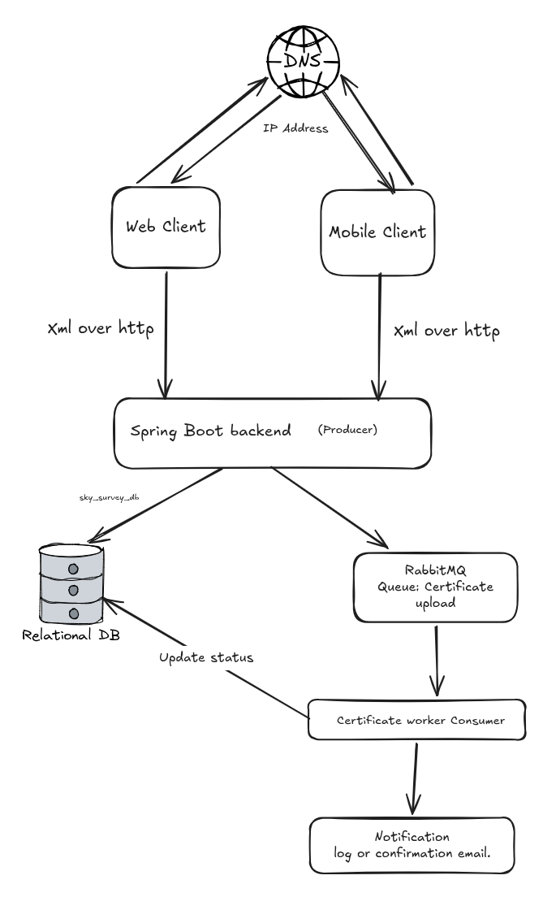
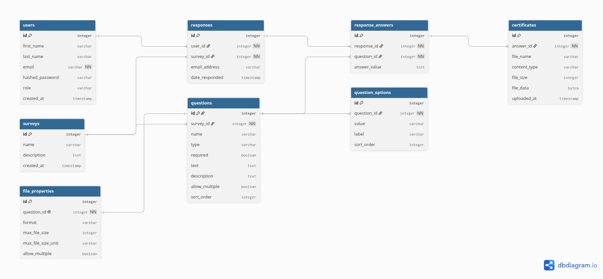

# Survey Platform

A dynamic survey platform where administrators create and manage surveys through the
application, no code changes required to add new surveys or questions,  and users
discover, complete, and submit surveys with PDF certificate uploads.

## Tech Stack

| Layer     | Technology                                             |
|-----------|--------------------------------------------------------|
| Frontend  | Angular 17+ (standalone components, signals), Angular Material, Tailwind CSS |
| Backend   | Java 21, Spring Boot 3.3 (Web, Data JPA, Validation), Jackson XML |
| Database  | PostgreSQL  `sky_survey_db`                            |
| API format| XML over HTTPS, `multipart/form-data` for submissions  |

## Repository Structure

```
.
├── backend/                  # Spring Boot REST API
│   ├── src/main/java/com/sky/survey/
│   │   ├── domain/           # JPA entities (metadata-driven model)
│   │   ├── repository/       # Spring Data repositories
│   │   ├── service/          # Business logic + metadata-driven validation
│   │   ├── api/              # Controllers, XML DTOs, mapper, error handling
│   │   └── exception/        # Domain exceptions
│   └── src/main/resources/application.yml
├── frontend/                 # Angular SPA
│   └── src/app/
│       ├── core/             # Models, XML parser, HTTP services, interceptors
│       ├── shared/           # Reusable components and pipes
│       ├── layout/           # Admin shell (sidenav, toolbar)
│       └── features/         # surveys | questions | take-survey | responses
├── db/
│   └── sky_survey_db.sql     # Schema + seed data (source of truth)
└── docs/
    ├── erd.png               # Entity Relationship Diagram
    └── postman_collection.json
```

## Architecture at a Glance

## Entity Relationship Diagram



## Getting Started

### Prerequisites

- Java 21+, Maven 3.9+
- Node.js 20+, Angular CLI 17+
- PostgreSQL 15+

### 1. Database

```bash
createdb sky_survey_db
psql -d sky_survey_db -f db/sky_survey_db.sql
```

The script creates the schema and seeds the example survey from the specification.
The API runs with `ddl-auto: validate` — the SQL script owns the schema.

### 2. Backend

```bash
cd backend
DB_USER=postgres DB_PASSWORD=postgres mvn spring-boot:run
```

The API starts on `http://localhost:8080`. Verify:

```bash
curl -H "Accept: application/xml" http://localhost:8080/api/surveys
```

### 3. Frontend

```bash
cd frontend
npm install
ng serve
```

Open `http://localhost:4200`. Requests to `/api` are proxied to the backend
(`proxy.conf.json`).

## Application Pages

| Route                      | Audience      | Purpose                                        |
|----------------------------|---------------|------------------------------------------------|
| `/surveys`                 | Administrator | Create, edit, delete, and view surveys         |
| `/surveys/:id/questions`   | Administrator | Manage questions and choice options            |
| `/surveys/:id/responses`   | Administrator | Paginated responses, email filter, downloads   |
| `/take`                    | Participant   | Browse available surveys                       |
| `/take/:id`                | Participant   | Stepped survey form with review and submission |

## API Summary

All endpoints produce `application/xml`.

| Method | Endpoint                              | Description                                  |
|--------|---------------------------------------|----------------------------------------------|
| GET    | `/api/surveys`                        | List surveys                                 |
| POST   | `/api/surveys`                        | Create survey                                |
| PUT    | `/api/surveys/{id}`                   | Update survey                                |
| DELETE | `/api/surveys/{id}`                   | Delete survey (cascades)                     |
| GET    | `/api/surveys/{id}/questions`         | List questions with options/file rules       |
| POST   | `/api/surveys/{id}/questions`         | Create question                              |
| PUT    | `/api/surveys/{id}/questions/{qid}`   | Update question (options replaced atomically)|
| DELETE | `/api/surveys/{id}/questions/{qid}`   | Delete question                              |
| POST   | `/api/surveys/{id}/responses`         | Submit response (`multipart/form-data`)      |
| GET    | `/api/surveys/{id}/responses`         | Paginated responses — `?page=1&pageSize=10&email=` |
| GET    | `/api/certificates/{id}`              | Download an uploaded certificate             |

Errors return XML with appropriate status codes:
`400` validation, `404` not found, `413` file too large, `500` unexpected.

## Question Types Supported

`short_text` · `long_text` · `email` · `choice` (single or multiple) · `file` (PDF upload
with per-question format, size, and multiplicity rules)

## Testing

Import `docs/postman_collection.json` into Postman. The collection covers every
endpoint with sample requests and saved responses, including error cases
(missing required field, unknown survey, oversized file).

## Roadmap / Production Notes

- JWT authentication separating admin and participant endpoints (two trust zones
  already exist in the route design)
- Object storage (S3) for certificates via the existing `FileStorageService` seam
- Soft-delete for surveys if audit requirements emerge
- CI pipeline: build + test both apps, lint, container images
