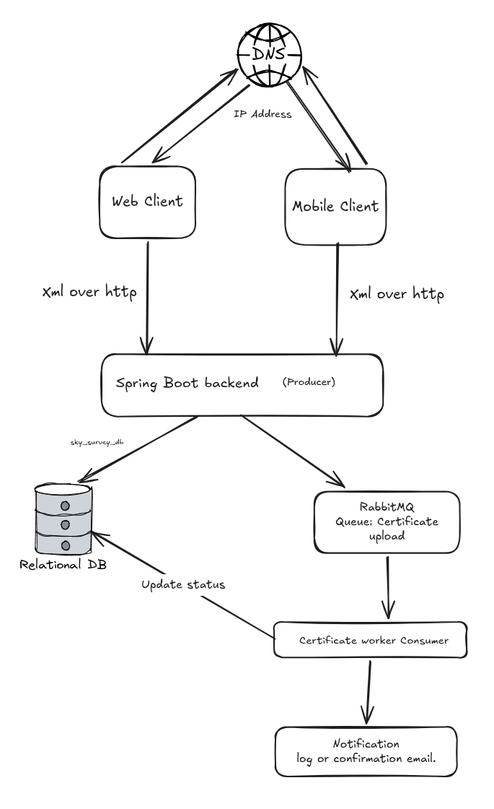
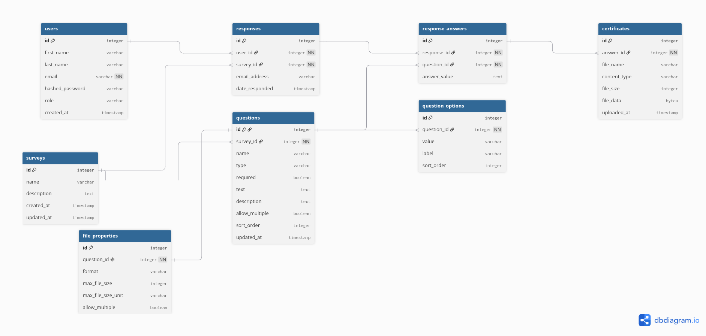

# Survey Platform

Survey Platform is a metadata-driven survey application. The repository currently
contains an Angular UI scaffold and a Spring Boot backend scaffold, together with
the database migrations and design diagrams used to shape the model.

## Repository layout

```text
.
├── survey-platform-backend/       # Spring Boot application
│   ├── src/main/java/io/github/darlene/surveyplatformbackend/
│   │   ├── authentication/        # Users, roles, auth DTOs and auth boundaries
│   │   ├── survey/                # Survey feature
│   │   ├── question/              # Question, option and file-rule feature
│   │   ├── response/              # Responses and submitted answers
│   │   ├── certificate/           # Uploaded certificate model and boundaries
│   │   ├── shared/                # XML mapper and shared exceptions
│   │   └── configuration/         # Application-wide configuration
│   └── src/main/resources/db/migration/  # Flyway schema migrations
├── survey-platform-ui/            # Angular application
│   └── src/app/core/               # Models, services and HTTP interceptors
└── docs/
    ├── erd.png                    # Entity relationship diagram
    └── System_Architecture.png    # System architecture diagram
```

The backend is organized by feature rather than by a single global `domain`,
`service`, `repository`, and `dto` tree. Feature folders may contain empty
controller/service/configuration placeholders while implementation is still in
progress; no behavior is implied by those placeholders.

## Technology stack

| Area | Technology |
| --- | --- |
| Backend | Java 25, Spring Boot 4.1.0, Spring Web MVC, Spring Data JPA, Spring Security |
| Persistence | PostgreSQL, Flyway migrations |
| Serialization | Jackson XML |
| Frontend | Angular 22, Angular Material, Tailwind CSS |
| Build tools | Maven Wrapper, npm |

## Database

Flyway migrations are located in
`survey-platform-backend/src/main/resources/db/migration`. They currently define
users, surveys, questions/options, file properties, responses/answers,
certificates, and timestamp triggers. Configure a PostgreSQL datasource through
the normal Spring datasource properties before starting the application.

## Running locally

### Backend

```bash
cd survey-platform-backend
./mvnw compile
./mvnw spring-boot:run
```

The backend currently has no checked-in datasource values in
`src/main/resources/application.properties`, so a PostgreSQL connection must be
provided through environment variables or Spring configuration.

### Frontend

```bash
cd survey-platform-ui
npm install
npm start
```

The Angular development server is configured by the UI project files and serves
the application locally on its usual Angular development port.

## Current status

- Backend source has been reorganized into feature packages.
- JPA entities, repositories, XML DTOs, Flyway migrations, and the shared XML
  mapper are present.
- Authentication, feature services, controllers, and complete API wiring are
  still being built out.
- `./mvnw compile` succeeds.
- The context test requires a configured PostgreSQL datasource and therefore
  cannot run in an environment without database settings.

## Design references




